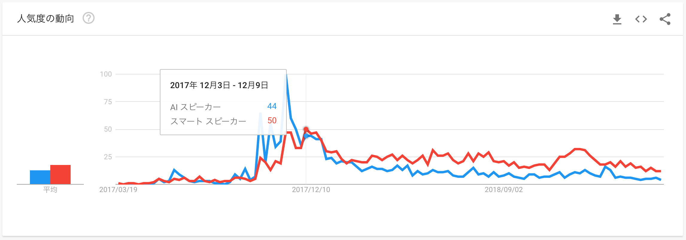

## 多摩大学 産業社会特講(スマートスピーカーアプリ開発)

### アンケート結果
### 2019/04/16

---

## 所属しているゼミで行っている研究について教えてください

プログラミング
AIが今どんなものがあるのかを調べています
出来たらコードをに触れていきたいと思っています

---

## AIとマシンラーニング(機械学習)とディープラーニング(深層学習)

[人工知能、機械学習、ディープラーニングの違いとは](https://blogs.nvidia.co.jp/2016/08/09/whats-difference-artificial-intelligence-machine-learning-deep-learning-ai/)

---

## ~~AIスピーカー~~ スマートスピーカー

---

## この授業を受講しようとしたきっかけを教えてください

- AIを使ったプログラミングをマスターしてエンジニアとして活躍したいから
- スマートスピーカーに興味があったからです
-  これからプログラミングを学んでそれをしごとにしていきたいと考えたからです。

---

## いままでJavaScriptを用いて、なにか作ったりしたことはありますか？

---

## Node.js

---

## スマートスピーカーを使って何ができると便利だと思いますか？

* 部屋の電気や音楽を自動でつけたりすることができる
* 家電を動かしたり、その時にに必要になった情報をちゃんと伝えてくれると便利だと思います。
* 目覚まし時計で朝起きたか確認する。

---

## 今回の授業で用いるスマートスピーカの特徴を挙げてください

* 音声アシスタントがある
* 一般に公開されているプラットホームがあるので、ある程度完成されている状態で月売り上げることができることです。
* ほかにも、スマートスピーカーなので対話ができることも特徴です。
* 家電を動かしたりも設計によってはできることではないでしょうか。"
* 絶対に寝坊しない。

---

## 今回の授業で用いるスマートスピーカで作るアプリのことを別名称でなんと呼ぶでしょうか？

* Alexa
* home
* ＮＯＩＤ

---

[NOID](https://www.noid.ai/)

---

## 今回の授業で用いるスマートスピーカーでできないことを一つ挙げてください。また、それができないと判断した根拠も記載してください。

* 基礎部分しか学べないと思うので実際に動かしたりはできないと思う
* 動画の視聴です。動画の視聴は、画面とそれを流すためのプログラミンが必要になってくるのでできないと思いました。
* しゃべること。そこまでのプログラミングを短期間で習得できるかが分からないから。

---

## Alexaで動画再生

[動画を再生するスキルを作ってみました](https://dev.classmethod.jp/cloud/alexa-video-skill/)

---
