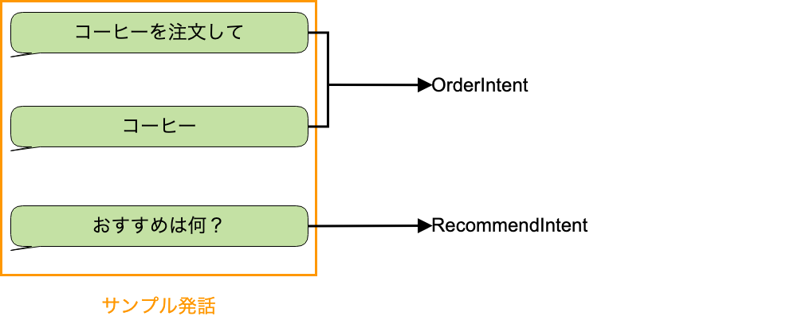

# 産業社会特講  
(スマートスピーカーアプリ開発)

2019/05/07

---

## 今回初回参加の場合アンケートに回答してください

* https://goo.gl/forms/8MKieMriDY94eL7x2

---

## 前回のおさらいのその前に

* チャットツールの導入をお願いします。
  * https://discord.gg/fSKHqQr
  * ユーザー名はメールアドレスの@tama.ac.jp の前を推奨します。

---

## 前回のおさらい

* Alexa Skill で ハローワールド
* Alexa とは

---

## カスタムスキルを作ろう

* コーヒーを注文できる（ような)スキルを作ります。

---

## デモ

[S2-EP4 サンプルカスタムスキルのデモ](https://www.youtube.com/watch?v=-_egTBtkHgc&feature=youtu.be)

---

## カスタムスキルの新規作成

1. [Alexa Skills Kit開発者コンソール](https://developer.amazon.com/alexa/console/ask#) に遷移します。
2. スキルの作成ボタンを押します。

--

## カスタムスキルの新規作成

3. スキル名を `コーヒーショップ` と入力します。
4. `スキルに追加するモデルを選択` は `カスタム`を選択します。
5. `スキルのバックエンドリソースをホスティングする方法を選択` は `Alexaがホスト` を選択します。

--

## カスタムスキルの新規作成

6. `スキルを作成` のボタンを押します。

---

## 対話モデルを作成する

---

## インテントとサンプル発話

* インテント
  * ユーザーの意図や要望
  * スキルはインテントを基準にユーザーの要望に答えます。
  * インテントはスキル内に複数定義することが可能です。
  * インテントには定義済みの標準ビルドインテントと開発者によって定義するカスタムインテントがあります。

--

## インテントとサンプル発話

* サンプル発話
  * 発話とは、ユーザーがAlexaに対して話しかける言葉のこと
  * カスタムスキルではユーザーの発話からインテントを導き出すためのサンプルを定義します。

---

## インテントの種類

---

## ビルトインインテント

[標準ビルトインインテント](https://developer.amazon.com/ja/docs/custom-skills/standard-built-in-intents.html)

---

## カスタムインテント

---

## カスタムインテントを作成する

1. `HelloWorldIntent` を `OrderIntent` に変更します。
2. サンプル発話はすべて削除し、コーヒー注文に用いる発話を入力します。
3. 編集後、 `モデルを保存` を押下し、 `モデルをビルド` を押します。

---

## カスタムインテントのリクエストを確認する

1. `Alexaシミュレータ` を起動し、`コーヒーショップを開いて、コーヒーをください` と入力します。
2. `JSON入力` のJSONの`request`のキーに対応するオブジェクトに`type:IntentRequest` や `intent.name : OrderIntent`となっていることを確認します。

---

## リクエストの種別

* LaunchRequest
  * スキルの呼び出し名のみで発話がなかった場合
* IntentRequest
  * スキルの呼び出し名の後に発話にマッチするインテントがあった場合
* SessionEndedRequest
  * ユーザーによる終了。ユーザーの応答がない場合、コード内でエラーが発生した場合