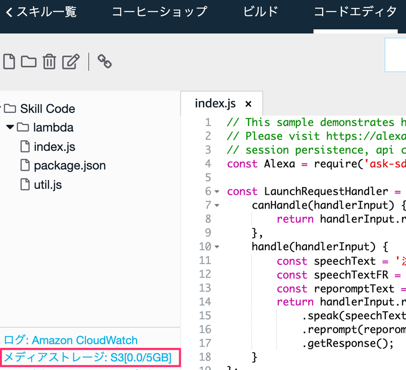
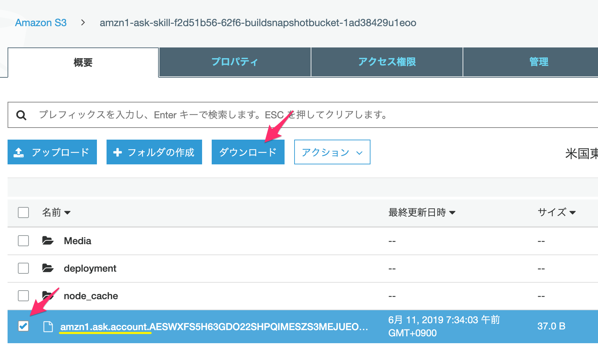

# 産業社会特講

永続アトリビュートを実装してみる

2019/06/11


---

## 実装例

<div style="text-align: left;">
    <p class="left">
        「コーヒーを2つですね。ご利用ありがとうございます。」
    </p>
</div>
<div class="center">
    <p>セッション終了</p>
</div>

--

## 実装例

<div style="text-align: left;">
<p class="left">
  「アレクサ、コーヒーショップを開いて」
</p> 
<p class="left">
  「前回はコーヒーを注文されました。今日は何にしますか？」
</p>
</div>

---

## 実装例

<div style="text-align: left;">
    <p class="left">
        「コーヒーを2つですね。ご利用ありがとうございます。」
    </p>
    <p class="left">
        {lastOrder="coffee"}を永続アトリビュートに保存する。
    </p>
</div>
<div class="center">
    <p>セッション終了</p>
</div>

--

## 実装例

<div style="text-align: left;">
<p class="left">
  「アレクサ、コーヒーショップを開いて」
</p> 
    <p class="left">
        永続アトリビュートのlastOrderを取得する。
    </p>
<p class="left">
  「前回はコーヒーを注文されました。今日は何にしますか？」
</p>
</div>

---

## ライブラリを追加する

### package.json

```
"dependencies": {
    "ask-sdk-core": "^2.5.0",
    "ask-sdk-model": "^1.4.1",
    "ask-sdk-s3-persistence-adapter": "^2.6.0",
    "aws-sdk": "^2.326.0"
}
```

---

##  永続アトリビュートを利用する(下準備)

### index.js

```
const Alexa = require('ask-sdk-core');
const persistenceAdapter = require('ask-sdk-s3-persistence-adapter');
```

--

```
exports.handler = Alexa.SkillBuilders.custom()
    .addRequestHandlers(
        ～中略～
    )
    .addErrorHandlers(
        ErrorHandler)
    // [**追加**] S3PersistentAdapter を PersistentAdapter に設定
    .withPersistenceAdapter(
        new persistenceAdapter.S3PersistenceAdapter(
            {bucketName:process.env.S3_PERSISTENCE_BUCKET}))
    .lambda();
```

---

##  永続アトリビュートを利用する(保存)

### index.js

```
const OrderIntentHandler = {
    ～中略～
    // [**追加**] 非同期処理のため async を追加する
    async handle(handlerInput) {;
```

--

```
    async handle(handlerInput) {;
        // 中略
        const speechText = `${menu} ${amount}つで${product_price * amount}円です。砂糖をつけてご用意します。ご利用ありがとうございます。`
        // [**追加**] 
        const attr = await handlerInput.attributesManager.getPersistentAttributes();
        attr.lastOrder = menu;
        handlerInput.attributesManager.setPersistentAttributes(attr);
        await handlerInput.attributesManager.savePersistentAttributes();
        // [**ここまで**] 
        return handlerInput.responseBuilder
            .speak(speechText)
            .getResponse();
    }
```

---

##  永続アトリビュートを利用する(参照)

### index.js

```
const LaunchRequestHandler = {
    ～中略～
    // [**追加**] 非同期処理のため async を追加する
    async handle(handlerInput) {;
```

--

```
        // [**追加/変更**]
        const attr = await handlerInput.attributesManager.getPersistentAttributes();
        const lastOrder = attr.lastOrder;
        let speechText = `ようこそ。`;
        if (lastOrder !== undefined) {
            speechText += `前回は ${lastOrder}を注文しましたね。`;
        }
        speechText += `今日は何を注文しますか?`;
```

---

## 作成されたS3のファイルを確認する

1. 永続アトリビュートの実装が動いていることを確認します。
1. コードエディタからメディアストレージをクリックします。

--



--

## 作成されたS3のファイルを確認する
2. AWSのS3のマネージメントコンソールの画面が表示されるので、バケット名を選択します。


--


--

## 作成されたS3のファイルを確認する

1.`amzn1.ask.account.` から始まるファイルがあるので、選択肢、ダウンロードします。


--



--

## 作成されたS3のファイルを確認する

1.  開いてみると、以下のように永続アトリビュートに保存した値が入っていることがわかります。

```
{"lastOrder":"ホットコーヒー"}
```

---

## 課題

1. スキルを使ってくれたユーザーに`３日ぶりですね、お久しぶりです。` といった回答をするためにどういった情報を永続アトリビュートに入れたらよいかを検討してください

2. 実際にスキルに上記を実装してみてください。


<style type="text/css">
  .reveal h1,
  .reveal h2,
  .reveal h3,
  .reveal h4,
  .reveal h5,
  .reveal h6 {
    text-transform: none;
  }
  .reveal h3
   {
       text-align: left;
  }
.left {
float: left;
}
.image70 {
    max-height: 70% !important;
    max-width: 70% !important;
}
.center{
  text-align: center;
}
img.icon {
width: 60px;
height: 60px;
float: left;
}
.mes{
  display:inline-block;
  vertical-align:top;
}
</style>

---
