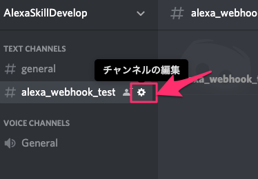
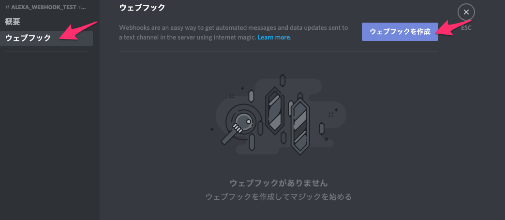
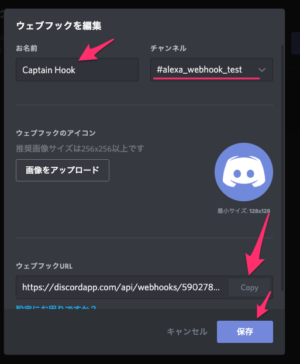

# 産業社会特講

(スマートスピーカーアプリ開発)

2019/06/18

---

## 前回のおさらい

- 永続アトリビュート
- AWS S3

---

## 前回のおさらい

1. スキルを使ってくれたユーザーに`３日ぶりですね、お久しぶりです。` といった回答をするためにどういった情報を永続アトリビュートに入れたらよいかを検討してください

unix時間で購入時間を格納する。
[unix時間](https://ja.wikipedia.org/wiki/UNIX%E6%99%82%E9%96%93)

javasciprt での実装例
```
Math.floor((new Date()).getTime()/1000)
```

--

2. 実際にスキルに上記を実装してみてください。

```javascript
const attr = await handlerInput.attributesManager.getPersistentAttributes();
const lastOrder = attr.lastOrder;
const lastDate = attr.lastDate;
const nowDate = Math.floor((new Date()).getTime()/1000)
console.log(nowDate)
console.log(lastDate)
let diffDate = null
if(lastDate){
    diffDate = nowDate - lastDate
}
const diffDay =  Math.floor(diffDate / (24 * 60 * 60))
let speechText = `ようこそ。`;
if (diffDate && diffDay > 0) {
    speechText += ` ${diffDay}ぶりですね、お久しぶりです。`;
}
if (lastOrder !== undefined) {
    speechText += `前回は ${lastOrder}を注文しましたね。`;
}
attr.lastDate = nowDate
await handlerInput.attributesManager.savePersistentAttributes()
```

---

## Discord連携

Alexaのスキルを開発するに当たり、スキルの中で様々な外部サービスを呼び出すと言ったことが可能です。
今回の例では注文があったときにDiscordにメッセージを飛ばしてみます。

---

## 実装方針

今回例では、Discordを見るのは店舗のスタッフというシナリオにします。
ユーザーがコーヒーを発注したら、Discordにその内容が転送されるといった内容を実装したいと思います。

---

## ハッピーパスを作る

* ハッピーパス、とはユーザとAlexaが適切なやり取りを最後までする内容のこと
* この時点で会話が長いと感じたらパスを考え直す
* 音声より画面がいい、と感じたらイチから考え直すことも

---

## 実装例

<div style="text-align: left;">
<p>
  「アレクサ、コーヒーショップを開いて、コーヒーを二つください」
</p> 
<p>
  「コーヒー２つですね。ご利用ありがとうございました。」
</p>
</div>

--

### Discord

<div style="text-align: left;">
<p>
  「コーヒーが２つ注文されました。準備をお願いします。」
</p> 
</div>

---

## Webhook

Alexa のスキルとDiscordを連携する方法としてWebhookという方法を用います。
手順としては以下になります。

* 通知を行う部屋に対して発言を行うWebhookのURLを払い出す。
* スキルの中で注文が確定した段階で、上記で払い出したWebhookに対してリクエストを送る

---

## WebhookのURLの払い出し

Webhook連携用のチャンネルを作ったので、そこにWebhookを作成していきます。
以下で払い出されるWebhook URLをコピーしておきます。



--



--



---

## 実装(下準備)

`request` というモジュールを使います。
package.json に以下の記述をしてください。

```json
  "dependencies": {
    "ask-sdk-core": "^2.5.0",
    "ask-sdk-model": "^1.4.1",
    "ask-sdk-s3-persistence-adapter": "^2.6.0",
    "aws-sdk": "^2.326.0",
    "request": "^2.88.0"
  }
```

---

## 実装

```javascript
const request = require('request');
discordWebHookUri = 'コピーしたWebHookのURL'
const options = {
  uri: discordWebHookUri,
  headers: {
    "Content-type": "application/json",
  },
  json: {
    "username": "test",
    "content": "hello"
  }
};
request.post(options, function(error, response, body){});
```


--

[Execute Webhook ](https://discordapp.com/developers/docs/resources/webhook#execute-webhook)


<style type="text/css">
  .reveal h1,
  .reveal h2,
  .reveal h3,
  .reveal h4,
  .reveal h5,
  .reveal h6 {
    text-transform: none;
  }
  .reveal h3
   {
       text-align: left;
  }
.left {
float: left;
}
.image70 {
    max-height: 70% !important;
    max-width: 70% !important;
}
.center{
  text-align: center;
}
img.icon {
width: 60px;
height: 60px;
float: left;
}
.mes{
  display:inline-block;
  vertical-align:top;
}
</style>