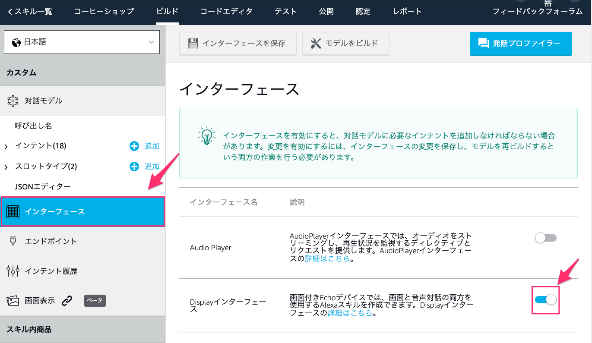
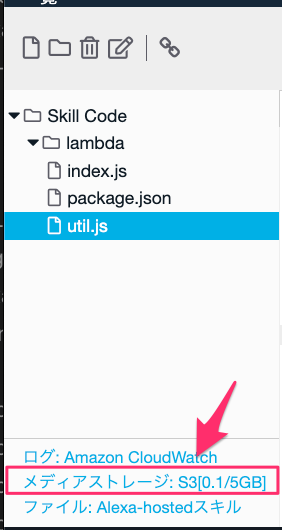
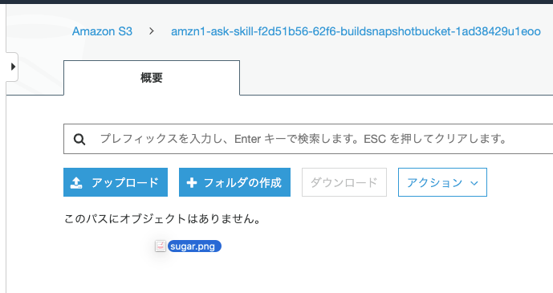
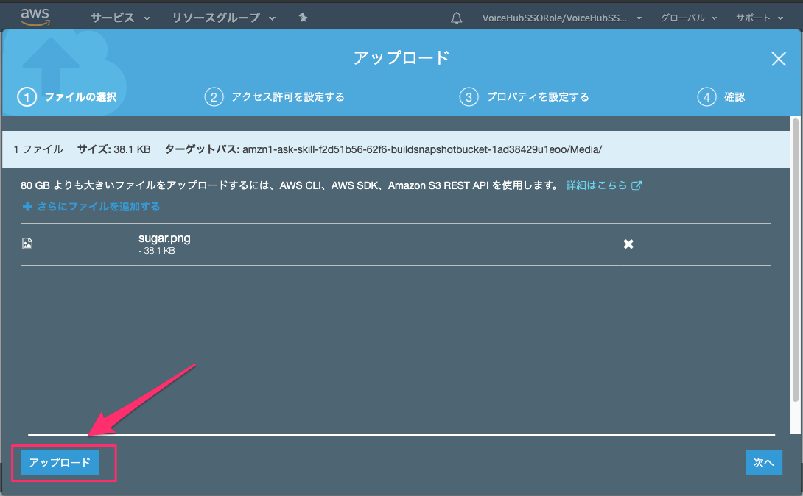

# 産業社会特講

(スマートスピーカーアプリ開発)

2019/06/25

---

## 前回のおさらい

- Webhookを用いたDiscord連携

---

##  音声と視覚のエクスペリエンスを備えたスキルの開発

- Demo

---

## Displayインターフェースを有効にする

開発者コンソールからインターフェース→Displayインターフェースで有効にします。


--



---

## 顔像付きの応答を実装する(下準備)

砂糖の画像を用意し、S3に配置します。


--



--



--



---

## 顔像付きの応答を実装する

画像を取得するためには一時URLを払い出す必要があります。

[Alexa-hostedスキルでメディアファイルを使うにはどうすればよいですか？](https://developer.amazon.com/ja/docs/hosted-skills/build-a-skill-end-to-end-using-an-alexa-hosted-skill.html#media)

---

## 画像付きの応答を実装する

必要なユーティリティを取り込みます。

```javascript
const Util = require('util.js');
```

--

画像のURLを取得し、画像つきの応答を実装します。

```javascript
const speechText = `${menu} ${amount}つですね、砂糖はおつけしますか？`
const reSpeechText = `砂糖はおつけしますか？`
const title = 'コーヒーショップ'
const pictureUrl = Util.getS3PreSignedUrl("Media/sugar.png");
const image = new Alexa.ImageHelper()
    .addImageInstance(pictureUrl)
    .getImage();
const textContent = new Alexa.RichTextContentHelper()
    .withPrimaryText('砂糖はいりますか？')
    .getTextContent();
return handlerInput.responseBuilder
    .speak(speechText)
    .reprompt(reSpeechText)
    .addRenderTemplateDirective({
        type: 'BodyTemplate2',
        backButton: 'VISIBLE',
        image: image,
        title: title,
        textContent: textContent,
    })
    .getResponse();
```

---

## 画像付きの応答の実装を確認する

Alexaシミュレータで動かすと、スキルI/Oの下の箇所で画像つきの応答が表示されていることがわかります。

---

## 画像付き応答をカスタマイズする。

今回用いた画像付き応答は他にもテンプレートが用意されています。
また、他にもカスタマイズできる箇所が存在しています。
[ドキュメント](https://developer.amazon.com/ja/docs/custom-skills/display-interface-reference.html)や[ブログ](https://dev.classmethod.jp/cloud/alexa-sdk-v2-seventh/) を確認して、カスタマイズをしてみましょう。


--

以下は表示するテキストとそのフォントを増やした例になります。

```javascript
const textContent = new Alexa.RichTextContentHelper()
    .withPrimaryText('砂糖はいりますか？')
    .withSecondaryText('<font size="7">本日コーヒー一杯無料！！</font>')
    .withTertiaryText('<font size="1">多摩コーヒー</font>')
    .getTextContent();
```


---

## 画面表示非対応デバイス対応


--

### ヘルパー関数を実装する

utils.jsに以下を実装します。
```javascript
module.exports.isDisplaySupported = function isDisplaySupported(request) {
  return request
    && request.context
    && request.context.System
    && request.context.System.device
    && request.context.System.device.supportedInterfaces
    && request.context.System.device.supportedInterfaces['Display'];
}
```

--

### ディスプレイの実装の有無を確認し、適切なレスポンスを返す

```javascript
const builder = handlerInput.responseBuilder
    .speak(speechText)
    .reprompt(speechText);
if (Util.isDisplaySupported(handlerInput.requestEnvelope)) {
    ...
    builder.addRenderTemplateDirective({
        type: 'BodyTemplate2',,
        ...
    });
}
return builder.getResponse();
```

---

## 課題

注文完了時に注文した商品の画像が出るようにしましょう。

* ホットコーヒ
* カフェオレ
* カフェラテ
* オレンジジュース

参考:[いらすとや](https://www.irasutoya.com/)

<style type="text/css">
  .reveal h1,
  .reveal h2,
  .reveal h3,
  .reveal h4,
  .reveal h5,
  .reveal h6 {
    text-transform: none;
  }
  .reveal h3
   {
       text-align: left;
  }
.left {
float: left;
}
.image70 {
    max-height: 70% !important;
    max-width: 70% !important;
}
.center{
  text-align: center;
}
img.icon {
width: 60px;
height: 60px;
float: left;
}
.mes{
  display:inline-block;
  vertical-align:top;
}
</style>